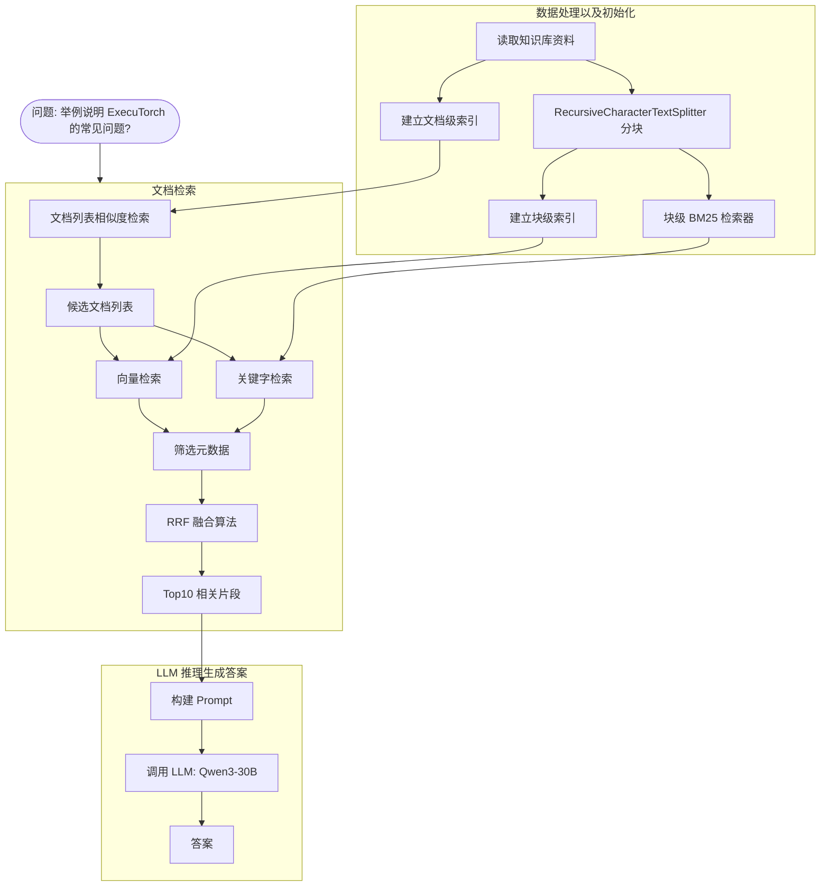

# RAG 企业知识库问答示例

## 🎯 示例目的

本示例演示如何构建一个**多阶段检索增强生成（RAG）系统**，用于解决企业知识库问答场景中的典型问题：

- **文档过多时的检索效率问题**：通过文档级粗排快速过滤不相关文档
- **单一检索方式的局限**：结合 BM25（关键词）和向量检索（语义）的优势
- **检索结果的准确性**：使用 RRF 融合算法综合多种检索结果
- **答案的可信度**：限制 LLM 仅基于检索到的资料回答，不足时回答"不知道"

通过本示例，你可以学习：
1. 如何使用 LangChain 构建完整的 RAG 流程
2. 如何实现多阶段检索策略（粗排+精排）
3. 如何融合多种检索方法提升效果
4. 如何对接本地 LLM（Ollama/vLLM）降低成本

---

## 📁 项目结构

```
rag/
├── main.py              # 主程序：完整的 RAG 实现
├── pyproject.toml       # 依赖配置
├── data/raw/            # 知识库文档目录
├── .env                 # 环境变量配置（需手动创建）
└── README.md            # 本文件
```

---

## 🏃 快速开始

### 1. 环境准备

```bash
# 克隆项目后进入目录
cd rag

# 安装依赖（使用 uv 或 pip）
uv sync
# 或
pip install -e .
```

### 2. 配置环境变量

创建 `.env` 文件：

```env
# 使用 Ollama 本地模型
OPENAI_API_BASE=http://localhost:11434/v1
OPENAI_API_KEY=ollama

# 或使用其他兼容 OpenAI API 的服务
# OPENAI_API_BASE=http://your-api-endpoint/v1
# OPENAI_API_KEY=your-api-key
```

### 3. 准备知识库

将文档放入 `data/raw/` 目录，例如：
```
data/raw/
├── 01-getting-started.md
├── 02-installation.md
└── 03-frequently-asked-questions.md
```

### 4. 修改查询问题

编辑 `main.py` 中的 `USER_INPUT`：

```python
# 示例问题
USER_INPUT = "举例说明 ExecuTorch 的常见问题有哪些？"
```

### 5. 运行程序

```bash
python main.py
```

---

## 📊 详细运行流程

### 整体流程图

<!--
```
┌─────────────────────────────────────────────────────────────────────────┐
│                           RAG 多阶段检索流程                              │
└─────────────────────────────────────────────────────────────────────────┘
                                    │
                                    ▼
┌─────────────────────────────────────────────────────────────────────────┐
│  阶段 0: 数据预处理                                                      │
│  ─────────────────────────────────────────────────────────────────────── │
│  • 读取 data/raw/ 下的所有文档                                           │
│  • 使用 RecursiveCharacterTextSplitter 分块                             │
│    - chunk_size=500 (每块约 500 字符)                                     │
│    - chunk_overlap=50 (块间重叠，避免信息割裂)                             │
│  • 建立两种索引：                                                         │
│    - doc_index: 文档级索引（用于粗排）                                     │
│    - chunk_index: 块级索引（用于精排）                                      │
│  • 初始化 BM25 检索器                                                      │
│  • 初始化 Embedding 模型                                                  │
└─────────────────────────────────────────────────────────────────────────┘
                                    │
                                    ▼
┌─────────────────────────────────────────────────────────────────────────┐
│  阶段 1: 文档级检索（粗排）                                                │
│  ─────────────────────────────────────────────────────────────────────── │
│  输入: USER_INPUT = "举例说明 ExecuTorch 的常见问题有哪些？"                 │
│                                                                 │
│  doc_index.similarity_search(query=USER_INPUT, k=2)                       │
│                                    │                                    │
│                                    ▼                                    │
│  输出候选文档: ['03-frequently-asked-questions.md',                       │
│                '01-getting-started.md']                                  │
└─────────────────────────────────────────────────────────────────────────┘
                                    │
                                    ▼
┌─────────────────────────────────────────────────────────────────────────┐
│  阶段 2: 文档内块检索（精排）                                              │
│  ─────────────────────────────────────────────────────────────────────── │
│  在候选文档内部进行精细检索：                                               │
│                                                                 │
│  向量检索: chunk_index.similarity_search(k=20)                          │
│       │                            │                                    │
│       │                            ▼                                    │
│       │    筛选 metadata["source"] in candidate_docs                    │
│       │                            │                                    │
│       ▼                            ▼                                    │
│  chunk_result ──────────┐                                              │
│                         │                                              │
│  BM25检索: bm25_retriever.invoke(k=20)                                  │
│       │                            │                                    │
│       │                            ▼                                    │
│       │    筛选 metadata["source"] in candidate_docs                    │
│       │                            │                                    │
│       ▼                            ▼                                    │
│  bm25_chunk_result ─────┘                                              │
│                         │                                              │
│                         ▼                                              │
│              ┌────────────────────┐                                    │
│              │    RRF 融合算法     │                                    │
│              │  (Reciprocal Rank   │                                    │
│              │   Fusion)           │                                    │
│              │                     │                                    │
│              │  score(d) = Σ      │                                    │
│              │      1/(k + rank)  │                                    │
│              │      k=60           │                                    │
│              └────────────────────┘                                    │
│                         │                                              │
│                         ▼                                              │
│              输出 Top-10 相关片段                                        │
│  ranked_chunks = [片段1, 片段2, ..., 片段10]                             │
└─────────────────────────────────────────────────────────────────────────┘
                                    │
                                    ▼
┌─────────────────────────────────────────────────────────────────────────┐
│  阶段 3: LLM 推理生成答案                                                │
│  ─────────────────────────────────────────────────────────────────────── │
│  构建提示词：                                                              │
│                                                                 │
│  ┌───────────────────────────────────────────────────────────────────┐  │
│  │  你是企业知识库助手。                                               │  │
│  │  请仅根据以下资料回答问题。                                         │  │
│  │  如果资料不足，请回答"不知道"。                                      │  │
│  │                                                                     │  │
│  │  资料：                                                             │  │
│  │  {片段1内容}                                                        │  │
│  │  ---                                                                │  │
│  │  {片段2内容}                                                        │  │
│  │  ---                                                                │  │
│  │  ...                                                                │  │
│  │                                                                     │  │
│  │  问题：举例说明 ExecuTorch 的常见问题有哪些？                        │  │
│  └───────────────────────────────────────────────────────────────────┘  │
│                                                                 │
│  LLM 调用: qwen3:30b (或配置的其他模型)                                    │
│  temperature=0.1 (低温度，保证答案稳定性)                                  │
│                                                                 │
│                                    │                                    │
│                                    ▼                                    │
│                         输出最终答案                                     │
└─────────────────────────────────────────────────────────────────────────┘
```
-->


---

## 🖥️ 运行示例输出

```bash
$ python main.py

=== 第一阶段：文档级检索 ===
候选文档: ['03-frequently-asked-questions.md', '01-getting-started.md']

=== 第二阶段：文档内 chunk 检索 ===
检索到 10 个相关文档片段

=== LLM 输出 ===
根据提供的资料，ExecuTorch的常见问题包括：

1. **What models are supported?**（支持哪些模型？）
   - 每个hook文档子页面都包含支持模型部分，列出了在库中几乎无需设置即可运行的模型。

2. **How can I run my own AI model?**（如何运行自己的AI模型？）
   - 需要直接访问底层的ExecuTorch Module API，库提供了React hook和TypeScript替代方案。

3. **Can I run GGUF models using the library?**（能否使用库运行GGUF模型？）
   - 不行，目前ExecuTorch运行时没有可靠方式使用GGUF模型。

...
```

---

## 🔧 核心技术点

| 组件 | 技术选型 | 说明 |
|------|----------|------|
| **文档分割** | `RecursiveCharacterTextSplitter` | 智能文本分割，保持语义完整性 |
| **嵌入模型** | `OpenAIEmbeddings(model="emb@bge-m3")` | BGE-M3 多语言嵌入模型 |
| **向量存储** | `InMemoryVectorStore` | 内存级存储，适合小规模测试 |
| **稀疏检索** | `BM25Retriever` | 基于概率排序的关键词检索 |
| **融合算法** | RRF (Reciprocal Rank Fusion) | 综合多个排序列表的融合算法 |
| **LLM 接口** | LangChain `init_chat_model` | 兼容 OpenAI API 协议 |

---

## 📦 依赖说明

```toml
[project]
name = "rag"
version = "0.1.0"
requires-python = ">=3.12"

dependencies = [
    "langchain>=1.2.10",                # LangChain 核心
    "langchain-community>=0.4.1",       # 社区组件（BM25Retriever）
    "langchain-openai>=1.1.10",         # OpenAI 集成
    "langchain-text-splitters>=1.1.1",  # 文本分割
    "python-dotenv>=1.2.1",             # 环境变量管理
    "rank-bm25>=0.2.2",                 # BM25 算法实现
]
```

---

## 💡 进阶优化方向

### 生产环境改进

```python
# 1. 使用持久化向量数据库（替代 InMemoryVectorStore）
# 示例：FAISS / Milvus / Chroma
from langchain_community.vectorstores import FAISS
vectorstore = FAISS.from_documents(docs, embeddings)

# 2. 使用 Elasticsearch（替代纯算法 BM25）
# 提供更好的扩展性和性能

# 3. 添加 Cross-Encoder 精排（RRF 融合后再模型精排）
# 使用 sentence-transformers 的 CrossEncoder 对 Top-K 重新排序
from sentence_transformers import CrossEncoder
reranker = CrossEncoder('cross-encoder/ms-marco-MiniLM-L-6-v2')
```

### 检索参数调优

| 参数 | 当前值 | 调优建议 |
|------|--------|----------|
| `chunk_size` | 500 | 长文档可增大至 1000 |
| `chunk_overlap` | 50 | 建议 chunk_size 的 10% |
| `doc_search_k` | 2 | 文档多时增大至 3-5 |
| `chunk_search_k` | 20 | 可调整至 30-50 |
| `rrf_limit` | 10 | 最终送入 LLM 的片段数 |
| `rrf_k` | 60 | 融合算法的平滑系数 |

---

## 📚 适用场景

- 📖 **产品文档问答** - 技术文档、用户手册查询
- 🎓 **内部培训资料** - 企业知识库、SOP 检索
- 🔧 **技术问题排查** - FAQ、故障排查指南
- 📋 **规章制度查询** - 公司政策、合规文档

---

## 🔗 参考资源

- [LangChain 文档](https://python.langchain.com/)
- [BM25 算法详解](https://www.elastic.co/blog/found-bm25)
- [RRF 融合论文](https://plg.uwaterloo.ca/~gvcormac/cormacksigir09-rrf.pdf)
- [RAG 最佳实践](https://www.pinecone.io/learn/series/rag/)

---

## 📝 License

MIT License